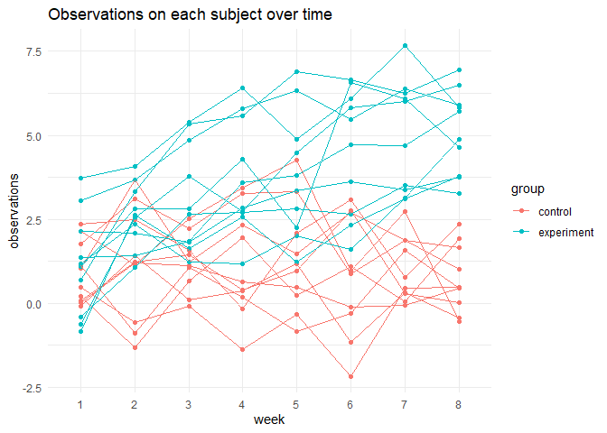
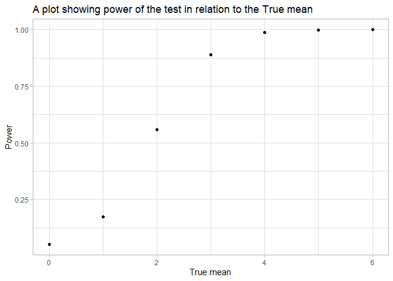
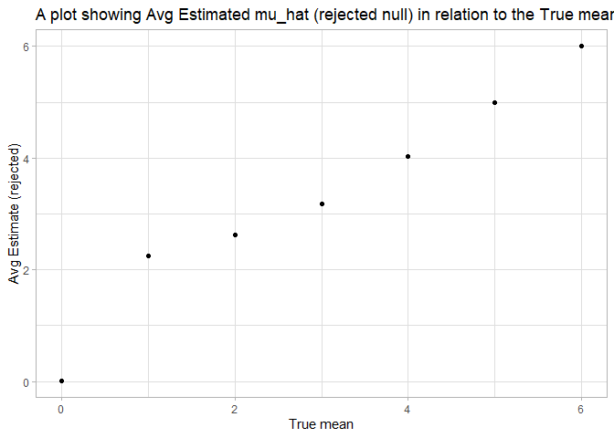

Homework 5
================
Wuraola Olawole
11/12/2020

## Problem 1

Read in the data.

``` r
homicide_df = 
  read_csv("homicide/homicide-data.csv") %>% 
  mutate(
    city_state = str_c(city, state, sep = "_"),
    resolved = case_when(
      disposition == "Closed without arrest" ~ "unsolved",
      disposition == "Open/No arrest"        ~ "unsolved",
      disposition == "Closed by arrest"      ~ "solved",
    )
  ) %>% 
  select(city_state, resolved) %>% 
  filter(city_state != "Tulsa_AL")
```

Let’s look at this a bit

``` r
aggregate_df = 
  homicide_df %>% 
  group_by(city_state) %>% 
  summarize(
    hom_total = n(),
    hom_unsolved = sum(resolved == "unsolved")
  )
```

    ## `summarise()` ungrouping output (override with `.groups` argument)

Can I do a prop test for a single city?

``` r
prop.test(
  aggregate_df %>% filter(city_state == "Baltimore_MD") %>% pull(hom_unsolved), 
  aggregate_df %>% filter(city_state == "Baltimore_MD") %>% pull(hom_total)) %>% 
  broom::tidy()
```

    ## # A tibble: 1 x 8
    ##   estimate statistic  p.value parameter conf.low conf.high method    alternative
    ##      <dbl>     <dbl>    <dbl>     <int>    <dbl>     <dbl> <chr>     <chr>      
    ## 1    0.646      239. 6.46e-54         1    0.628     0.663 1-sample~ two.sided

Try to iterate ……..

``` r
results_df = 
  aggregate_df %>% 
  mutate(
    prop_tests = map2(.x = hom_unsolved, .y = hom_total, ~prop.test(x = .x, n = .y)),
    tidy_tests = map(.x = prop_tests, ~broom::tidy(.x))
  ) %>% 
  select(-prop_tests) %>% 
  unnest(tidy_tests) %>% 
  select(city_state, estimate, conf.low, conf.high)
```

``` r
results_df %>% 
  mutate(city_state = fct_reorder(city_state, estimate)) %>% 
  ggplot(aes(x = city_state, y = estimate)) +
  geom_point() + 
  geom_errorbar(aes(ymin = conf.low, ymax = conf.high)) + 
  theme(axis.text.x = element_text(angle = 90, vjust = 0.5, hjust = 1))
```

<!-- -->

## Problem 2

``` r
path_df = 
  tibble(
    path = list.files("data", pattern = "*.csv")
  ) %>% 
  mutate(
    path = str_c("data/", path),
    dat = map(.x = path, ~read_csv(.x))) %>%
  unnest(dat)


read_csv(path_df$path[[1]])
```

    ## # A tibble: 1 x 8
    ##   week_1 week_2 week_3 week_4 week_5 week_6 week_7 week_8
    ##    <dbl>  <dbl>  <dbl>  <dbl>  <dbl>  <dbl>  <dbl>  <dbl>
    ## 1    0.2  -1.31   0.66   1.96   0.23   1.09   0.05   1.94

``` r
result =
        path_df %>%
          separate(path, c("group", "subject"), 
                   sep = "_", remove = TRUE) %>%
  mutate(
          group = str_replace(group, "data/con","control" ),
            group = str_replace(group, "data/exp", "experiment"),
              subject = str_replace(subject, ".csv", ""))
```

``` r
result =
        result %>%
          pivot_longer(
                      week_1:week_8,
                      names_to = "week",
                      values_to = "observations"
                      ) %>%
  mutate(
    week = str_replace(week, "week_", "")
  )
  
result          
```

    ## # A tibble: 160 x 4
    ##    group   subject week  observations
    ##    <chr>   <chr>   <chr>        <dbl>
    ##  1 control 01      1             0.2 
    ##  2 control 01      2            -1.31
    ##  3 control 01      3             0.66
    ##  4 control 01      4             1.96
    ##  5 control 01      5             0.23
    ##  6 control 01      6             1.09
    ##  7 control 01      7             0.05
    ##  8 control 01      8             1.94
    ##  9 control 02      1             1.13
    ## 10 control 02      2            -0.88
    ## # ... with 150 more rows

``` r
result %>%
    unite(sub_group, c(group, subject), sep = " ", remove = FALSE) %>%
      select(-subject) %>%
        ggplot(aes(x = week, y = observations )) +
          geom_point(aes(group = sub_group, color = group)) +
            geom_line(aes(group = sub_group, color = group)) + theme_minimal() +
  labs(title = "Observations on each subject over time")
```

<!-- -->

## Problem 3

``` r
mu = 0
sigma = 5
n = 30

# Random sample data frame
test_df = function(n = 30, mean= 0, sigma = 5) {
  
  sim_data = tibble(
    x = rnorm(n, mean, sigma),
  )
test_result =
  sim_data %>% 
    summarize(
      mu_hat = mean(x)) %>%
  mutate(
    t_test = map(.x = sim_data, ~t.test(x = .x, alternative = 'two.sided', mu =0, paired = FALSE, conf.level = 0.95)),
         tidy_test = map(.x = t_test, ~broom::tidy(.x))) %>%
  unnest(tidy_test) %>%
  select(mu_hat, estimate, p.value)
  return(test_result)
}
```

``` r
sim_results = 
  tibble(mu_size = c(0, 1, 2, 3, 4, 5, 6)) %>% 
  mutate(
    output_lists = map(.x = mu_size, ~rerun(5000, test_df(mean = .x))),
    estimate_dfs = map(output_lists, bind_rows)) %>% 
  select(-output_lists) %>% 
  unnest(estimate_dfs)
```

``` r
alpha = 0.05
sim_results %>%
  group_by(mu_size) %>%
summarize(power = mean(p.value < alpha)) %>%
  ggplot(aes(x = mu_size, y = power )) + geom_point() +
  labs(title = "A plot showing power of the test in relation to the True mean",
       x = "True mean", 
       y = "Power" ) + theme_light()
```

    ## `summarise()` ungrouping output (override with `.groups` argument)

<!-- -->

``` r
sim_results %>%
  group_by(mu_size) %>%
  summarize(avg_est = mean(estimate)) %>%
  ggplot(aes(x = mu_size, y = avg_est)) + geom_point() +
  labs(title = "A plot showing Avg Estimated mu_hat in relation to the True mean",
       x = "True mean",
       y = "Avg estimate") + theme_light()
```

    ## `summarise()` ungrouping output (override with `.groups` argument)

<!-- -->

``` r
sim_results %>%
  filter(p.value < alpha) %>%
  group_by(mu_size) %>%
  summarize(avg = mean(estimate)) %>%
  ggplot(aes(x = mu_size, y = avg)) + geom_point() +
  labs(title = "A plot showing Avg Estimated mu_hat (rejected null) in relation to the True mean",
       x = "True mean",
       y = "Avg Estimate (rejected)") + theme_light()
```

    ## `summarise()` ungrouping output (override with `.groups` argument)

<!-- -->
