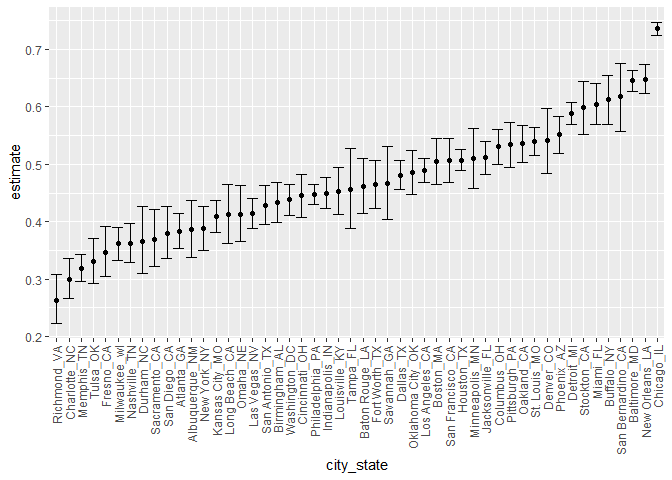
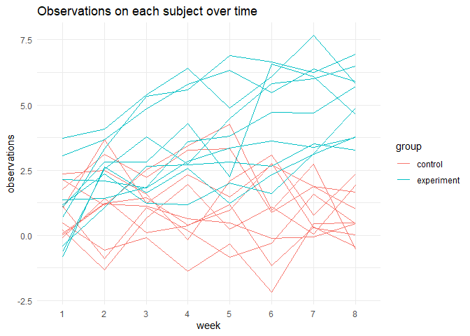
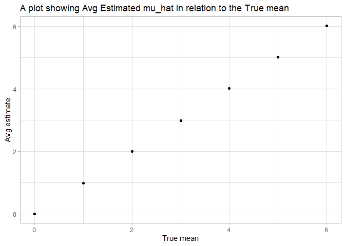

Homework 5
================
Wuraola Olawole
11/12/2020

## Problem 1

``` r
homicide_df = 
  read_csv("homicide/homicide-data.csv")
```

    ## 
    ## -- Column specification --------------------------------------------------------
    ## cols(
    ##   uid = col_character(),
    ##   reported_date = col_double(),
    ##   victim_last = col_character(),
    ##   victim_first = col_character(),
    ##   victim_race = col_character(),
    ##   victim_age = col_character(),
    ##   victim_sex = col_character(),
    ##   city = col_character(),
    ##   state = col_character(),
    ##   lat = col_double(),
    ##   lon = col_double(),
    ##   disposition = col_character()
    ## )

The raw data set has 52179 rows and 12 variables. It contains the names,
sex, cities and gender of victims. It also gives information about the
disposition of the cases and the date they were reported.

``` r
homicide_df = 
  read_csv("homicide/homicide-data.csv") %>% 
  mutate(
    city_state = str_c(city, state, sep = "_"),
      resolved = case_when(
        disposition == "Closed without arrest" ~ "unsolved",
        disposition == "Open/No arrest"        ~ "unsolved",
        disposition == "Closed by arrest"      ~ "solved",
    )
  ) %>% 
  select(city_state, resolved) %>% 
  filter(city_state != "Tulsa_AL")
```

``` r
aggregate_df = 
              homicide_df %>% 
                group_by(city_state) %>% 
                  summarize(
                    hom_total = n(),
          hom_unsolved = sum(resolved == "unsolved")
              )
```

    ## `summarise()` ungrouping output (override with `.groups` argument)

Use the prop.test function to estimate the proportion of homicides that
are unsolved; save the output of prop.test as an R object,

``` r
prop.test(
            aggregate_df %>% filter(city_state == "Baltimore_MD") %>% pull(hom_unsolved), 
              aggregate_df %>% filter(city_state == "Baltimore_MD") %>% pull(hom_total)) %>% 
                broom::tidy()
```

    ## # A tibble: 1 x 8
    ##   estimate statistic  p.value parameter conf.low conf.high method    alternative
    ##      <dbl>     <dbl>    <dbl>     <int>    <dbl>     <dbl> <chr>     <chr>      
    ## 1    0.646      239. 6.46e-54         1    0.628     0.663 1-sample~ two.sided

prop.test for each city\!

``` r
results_df = 
            aggregate_df %>% 
              mutate(
                      prop_tests = map2(.x = hom_unsolved, .y = hom_total, ~prop.test(x = .x, n = .y)),
                        tidy_tests = map(.x = prop_tests, ~broom::tidy(.x))
                          ) %>% 
  select(-prop_tests) %>% 
    unnest(tidy_tests) %>% 
      select(city_state, estimate, conf.low, conf.high)
```

plot that shows the estimates and CIs for each city\!

``` r
results_df %>% 
          mutate(city_state = fct_reorder(city_state, estimate)) %>% 
            ggplot(aes(x = city_state, y = estimate)) +
              geom_point() + 
                geom_errorbar(aes(ymin = conf.low, ymax = conf.high)) + 
                  theme(axis.text.x = element_text(angle = 90, vjust = 0.5, hjust = 1))
```

<!-- -->

## Problem 2

Extract data frames containing all files, iterate over file names and
read in data

``` r
path_df = 
  tibble(
    path = list.files("data", pattern = "*.csv")
  ) %>% 
  mutate(
    path = str_c("data/", path),
    dat = map(.x = path, ~read_csv(.x))) %>%
  unnest(dat)


read_csv(path_df$path[[1]])
```

    ## # A tibble: 1 x 8
    ##   week_1 week_2 week_3 week_4 week_5 week_6 week_7 week_8
    ##    <dbl>  <dbl>  <dbl>  <dbl>  <dbl>  <dbl>  <dbl>  <dbl>
    ## 1    0.2  -1.31   0.66   1.96   0.23   1.09   0.05   1.94

Tidy data\!

``` r
result =
        path_df %>%
          separate(path, c("group", "subject"), 
                   sep = "_", remove = TRUE) %>%
  mutate(
          group = str_replace(group, "data/con","control" ),
            group = str_replace(group, "data/exp", "experiment"),
              subject = str_replace(subject, ".csv", ""))
```

``` r
result =
        result %>%
          pivot_longer(
                      week_1:week_8,
                      names_to = "week",
                      values_to = "observations"
                      ) %>%
  mutate(
    week = str_replace(week, "week_", "")
  )
  
result          
```

    ## # A tibble: 160 x 4
    ##    group   subject week  observations
    ##    <chr>   <chr>   <chr>        <dbl>
    ##  1 control 01      1             0.2 
    ##  2 control 01      2            -1.31
    ##  3 control 01      3             0.66
    ##  4 control 01      4             1.96
    ##  5 control 01      5             0.23
    ##  6 control 01      6             1.09
    ##  7 control 01      7             0.05
    ##  8 control 01      8             1.94
    ##  9 control 02      1             1.13
    ## 10 control 02      2            -0.88
    ## # ... with 150 more rows

Spaghetti plot\!

``` r
result %>%
    unite(sub_group, c(group, subject), sep = " ", remove = FALSE) %>%
      select(-subject) %>%
        ggplot(aes(x = week, y = observations )) +
            geom_line(aes(group = sub_group, color = group)) + theme_minimal() +
  labs(title = "Observations on each subject over time")
```

<!-- --> In
this plot, in the first 6 weeks, there is an overlap between the
observations in both groups. At the onset, only two subjects from the
experimental group have observations higher than observations in the
control group. As the weeks progressed, we see that the observations in
the experimental group gradually increases until in week 6, the
observations in the experimental group in all subjects are higher than
observations in the control group. In both groups, there are variations
in the observations.

## Problem 3

Write a function that takes values (n, mean, sigma) computes the mean
and one sample t-test with H : mu = 0

``` r
mu = 0
sigma = 5
n = 30

# Random sample data frame
test_df = function(n = 30, mean= 0, sigma = 5) {
  
  sim_data = tibble(
    x = rnorm(n, mean, sigma),
  )
test_result =
  sim_data %>% 
    summarize(
      mu_hat = mean(x)) %>%
  mutate(
    t_test = map(.x = sim_data, ~t.test(x = .x, alternative = 'two.sided', mu =0, paired = FALSE, conf.level = 0.95)),
         tidy_test = map(.x = t_test, ~broom::tidy(.x))) %>%
  unnest(tidy_test) %>%
  select(mu_hat, estimate, p.value)
  return(test_result)
}
```

simulation of 5000 data sets and means = 0, 1,2,3,4,5,6 using function
test\_df

``` r
sim_results = 
              tibble(mu_size = c(0, 1, 2, 3, 4, 5, 6)) %>% 
                mutate(
                      output_lists = map(.x = mu_size, ~rerun(5000, test_df(mean = .x))),
                      estimate_dfs = map(output_lists, bind_rows)) %>% 
  select(-output_lists) %>% 
    unnest(estimate_dfs)
```

plot power against true mean

``` r
alpha = 0.05
sim_results %>%
  group_by(mu_size) %>%
    summarize(power = mean(p.value < alpha)) %>%
      ggplot(aes(x = mu_size, y = power )) + geom_point() +
        labs(title = "A plot showing power of the test in relation to the True mean",
              x = "True mean", 
              y = "Power" ) + theme_light()
```

    ## `summarise()` ungrouping output (override with `.groups` argument)

<!-- -->
The farther away the true means are from mu = 0, the larger the
proportion of times the null is rejected. In other words, the larger the
effect size, the larger the power.

plot avg estimate mean against true mean and avg estimate when the null
hypothesis is rejected

``` r
sim_results %>%
  group_by(mu_size) %>%
    summarize(avg_est = mean(estimate)) %>%
      ggplot(aes(x = mu_size, y = avg_est)) + geom_point() +
        labs(title = "A plot showing Avg Estimated mu_hat in relation to the True mean",
              x = "True mean",
              y = "Avg estimate") + theme_light()
```

    ## `summarise()` ungrouping output (override with `.groups` argument)

<!-- -->

``` r
sim_results %>%
  filter(p.value < alpha) %>%
    group_by(mu_size) %>%
      summarize(avg = mean(estimate)) %>%
        ggplot(aes(x = mu_size, y = avg)) + geom_point() +
          labs(title = "A plot showing Avg Estimated mu_hat (rejected null) in relation to the True mean",
                x = "True mean",
                y = "Avg Estimate (rejected)") + theme_light()
```

    ## `summarise()` ungrouping output (override with `.groups` argument)

<!-- --> On
average, the sample average of mu\_hats across tests for which the null
is rejected are approximately equal to the true means. I say on average
because the higher the estimated mean, the more approximately equal it
is to the true mean. At lower values for instance when the true mean =
\~1, mu\_hat = \~ 2.2. But at higher values, for instance, when mu\_hat
= 6, the true mean = 6. So on average when the null is rejected, mu\_hat
is approximately equal to the true values of the mean.
